<!--
  Profile · 1837620622 · 传康Kk
  Visuals are self-hosted in assets/ (SVG), so they never depend on third-party image services.
  External requests: shields.io (badges) and komarev.com (profile views) only.
  Numbers in assets/stats.svg are a snapshot taken 2026-10-08.
-->


  

 


  


  


  

<a href="https://github.com/1837620622/cloudflare-bypass-2026"></a>
<a href="https://github.com/1837620622/chatgpt-specimen-toolbox"></a>

<a href="https://github.com/1837620622/windsurf-account-manager-releases"></a>
<a href="https://github.com/1837620622/cto-new-openai-proxy"></a>

<a href="https://github.com/1837620622/winsurf-switch"></a>
<a href="https://github.com/1837620622/wifi-security-toolkit"></a>

<a href="https://github.com/1837620622/fund-cn"></a>
<a href="https://github.com/1837620622/free-vpn-cknb"></a>

<b>All projects (13)</b>

| Project | Stars | 说明 |
|---------|:-----:|------|
| [cloudflare-bypass-2026](https://github.com/1837620622/cloudflare-bypass-2026) |  | 绕过 Cloudflare Turnstile 人机验证的工具集 |
| [chatgpt-specimen-toolbox](https://github.com/1837620622/chatgpt-specimen-toolbox) |  | ChatGPT 登录态在 9 种格式间互转，油猴脚本加浏览器扩展 |
| [windsurf-account-manager-releases](https://github.com/1837620622/windsurf-account-manager-releases) |  | Windsurf 多账号桌面端，自动续 token、看额度 |
| [cto-new-openai-proxy](https://github.com/1837620622/cto-new-openai-proxy) |  | 兼容 OpenAI / Anthropic 的反代，账号池轮询带面板 |
| [winsurf-switch](https://github.com/1837620622/winsurf-switch) |  | Windsurf 多账号一键切换 |
| [wifi-security-toolkit](https://github.com/1837620622/wifi-security-toolkit) |  | WPA 抓包加 hashcat 跑字典，附 2GB 中文优化字典 |
| [fund-cn](https://github.com/1837620622/fund-cn) |  | 国内基金实时估值，跑在 Cloudflare Workers |
| [free-vps](https://github.com/1837620622/free-vps) |  | 免费 VPS 和容器平台整理 |
| [Gold-Price-Quantitative-Monitoring-System](https://github.com/1837620622/Gold-Price-Quantitative-Monitoring-System) |  | 黄金量化监控面板，接 AI 做分析 |
| [codex-red-team-prompt](https://github.com/1837620622/codex-red-team-prompt) |  | 给 Codex 注入自定义系统提示词，红队研究用 |
| [windsurf-unlimited-cknb](https://github.com/1837620622/windsurf-unlimited-cknb) |  | Windsurf 破解版工具包 |
| [codex-inviter](https://github.com/1837620622/codex-inviter) |  | 一键发 ChatGPT Codex 邀请的网页 |
| [free-vpn-cknb](https://github.com/1837620622/free-vpn-cknb) |  | 免费 VPN 情报站，17 个源聚合，3D 页面 |

 

 

有项目合作或问题咨询，欢迎随时联系

  

 

